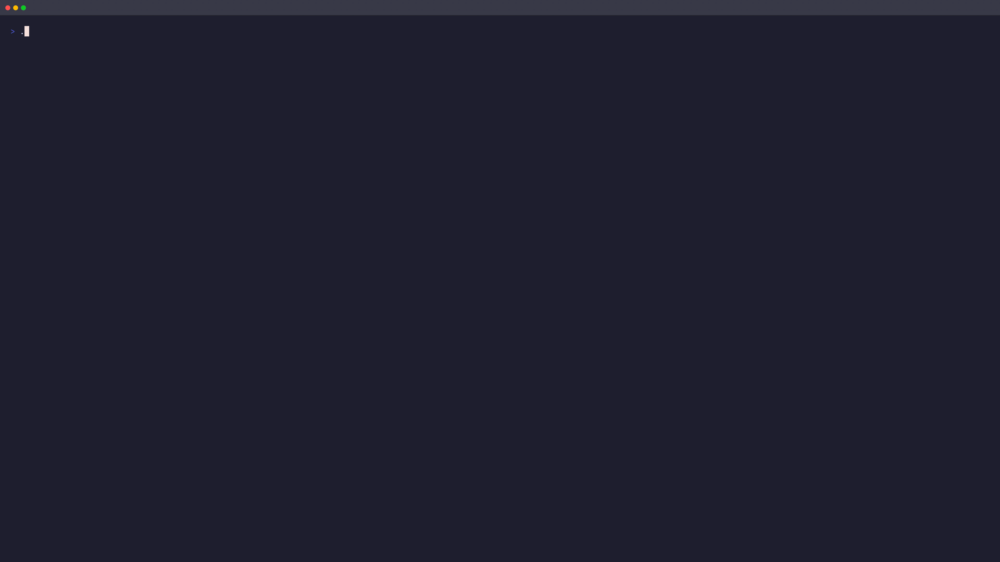

# lazycaddy 🦥

<p align="center"></p>

<p align="center"><em>🦥 The lazier way to manage your Caddyfile.</em></p>

<p align="center">
  <a href="https://github.com/PierpaoloPernici/lazycaddy/actions/workflows/ci.yml"></a>
  <a href="https://github.com/PierpaoloPernici/lazycaddy/releases/latest"></a>
  <a href="https://codecov.io/gh/PierpaoloPernici/lazycaddy"></a>
  <a href="https://github.com/PierpaoloPernici/lazycaddy/blob/main/LICENSE"></a>
  <a href="https://github.com/PierpaoloPernici/lazycaddy/blob/main/go.mod"></a>
</p>

<p align="center">lazycaddy is a keyboard-first terminal user interface for inspecting and managing Caddy while preserving the Caddyfile as the source of truth.</p>

<p align="center">
  <sub>The 🦥 is lazycaddy's mascot: deliberately unhurried, careful with your configuration.</sub>
</p>

## Screenshot

The TUI combines a navigable document tree, source inspection,
validation status and explicit editing actions in one terminal workspace.

<p align="center">
  
</p>

The project is under active development. Read the project direction and implementation constraints first:

- [VISION.md](VISION.md) — product vision and design principles;
- [PLAN.md](PLAN.md) — scope, architecture, safety workflow and roadmap;
- [AGENTS.md](AGENTS.md) — repository and contributor guidelines;
- [CONTRIBUTING.md](CONTRIBUTING.md) — development and contribution workflow;
- [SECURITY.md](SECURITY.md) — vulnerability reporting and security model;
- [CODE_OF_CONDUCT.md](CODE_OF_CONDUCT.md) — participation and conduct standards.

## Development

Requirements:

- Go 1.26 or newer;
- Caddy is not required for unit tests;
- network access is not required by tests.

Run the current TUI:

~~~sh
go run ./cmd/lazycaddy
~~~

Run checks:

~~~sh
make check
~~~

Run `make` without a target to list the available development commands.

Build a local binary, check the release configuration or run additional
quality checks with `make build`, `make release-check`, `make fmt-check`,
`make test-race` and `make coverage`.

Build local release artifacts for installation and testing on another machine:

~~~sh
make dist
~~~

Remove generated local artifacts (`bin/`, `dist/` and coverage files):

~~~sh
make clean
~~~

Show build information:

~~~sh
go run ./cmd/lazycaddy --version
~~~

The release process is documented in [docs/releasing.md](docs/releasing.md).

## Current status

The v0.4 milestone is complete. Current capabilities include:

- lossless browsing of Caddyfiles, imports, snippets and unknown directives;
- read-only source inspection with search, semantic highlighting, matcher
  navigation and display-only folding;
- safe editing with Caddy formatting and validation, diff review, backups,
  atomic writes and explicit reloads;
- `$EDITOR` workflows, node creation, deletion, reordering and rollback;
- read-only runtime, upstream health, logs and TLS dashboards;
- responsive layouts, state-aware headers, contextual footers and command
  palettes;
- clipboard integration and a bounded error history.

The Caddyfile remains the source of truth. lazycaddy is read-only by default,
never reloads Caddy implicitly and keeps browsing available when optional
runtime or filesystem capabilities are unavailable.

The next planned milestone is v0.5: remote server profiles and remote
operations. See [PLAN.md](PLAN.md) for the detailed capability list,
implementation status and roadmap, and [docs/designsystem.md](docs/designsystem.md)
for the UI/UX rules and keybindings.

### Safe change workflow

```text
load -> edit working copy -> format and validate -> review diff
  -> confirm -> create backup -> atomic save -> optional confirmed reload
```

Without `--config`, lazycaddy uses `./Caddyfile` when present and falls back
to `/etc/caddy/Caddyfile`. Without `--caddy-path`, it discovers `caddy`
through `PATH`; if the binary is unavailable, formatting, validation and
reload stay disabled. To pin both explicitly:

~~~sh
go run ./cmd/lazycaddy --config ./Caddyfile --caddy-path /usr/bin/caddy
~~~

To enable saving, add `--write`. The default backup directory is
`~/.local/state/lazycaddy/backups` (honoring `$XDG_STATE_HOME` when set) —
a user-state location chosen so system Caddyfiles never force backups next
to a root-owned config; it can be overridden with `--backup-dir`. The
default is a location, not a writability guarantee: if the resolved backup
directory is not writable, the save pipeline reports the failure. Formatting,
validation and saving use temporary or atomic file operations and do not
require a running Caddy daemon. Reloading does require Caddy to be running
with its Admin API enabled and reachable at the configured endpoint.

Backups keep the `<timestamp>-<seq>-<basename>` naming contract and each
also carries a plain-text `.src` identity sidecar holding its exact source
path, so backups of imported files that share a basename are never mixed
up. `B` opens the backup history of the selected document (read-only
comparison works without `--write`); in writable mode with a caddy binary
you can review the diff and roll back to a selected backup with an explicit
confirmation. Rollback validates the restored content in the context of
the full document graph — every document is mirrored into a temporary tree
that preserves its real directory layout, so relative imports and imported
snippet/fragment files resolve exactly as they do on disk — then backs up
the current file before the restore, never reloads Caddy implicitly, and
marks the loaded state unknown until you reload explicitly.

Backup retention is disabled by default. `--backup-retention N` keeps at
most `N` backups per source file, applied only after a successful save or
rollback; the newest backup and the backup created for the current
operation are always preserved, identity-less legacy backups and unrelated
files are never deleted, and any cleanup failure is reported without
undoing the completed operation.

Reloads use the local Admin API at `http://localhost:2019` by default;
override the endpoint with `--admin-endpoint` and the per-request timeout
with `--admin-timeout`. A reload never happens implicitly.

`D` diffs the currently selected document: the root compares the
validated working copy against the original after `v`, and any document
(imported files included, plus the root before `v`) is compared against
its current on-disk bytes. Inside the diff modal, `n`/`N` jump between
`@@` hunks, `h`/`l` scroll long lines horizontally, and the title shows
the change summary (`N hunks · +A −R`).

Quitting with unsaved edits opens a confirmation instead of exiting:
`s` saves (asynchronously, staying in the app), `d` discards and quits,
`Esc` cancels. The header shows an `UNSAVED` badge while edits are
pending; moving the cursor, searching, opening the log view or switching
documents never prompts.

Failures are recorded in a bounded error history opened with `H`, each
entry naming the failed operation and a safe next action. After a failed
save or rollback the status line points you at the recovery backup
(`B` on the affected document), and a cancelled editor edit surfaces its
pre-edit recovery snapshot path.

### Log sources

The log view (`l`) is opt-in and strictly read-only. Choose exactly one
source:

- `--log-file <path>` follows a Caddy log file (polling, rotation-aware),
  for example:

  ~~~sh
  go run ./cmd/lazycaddy --log-file /var/log/caddy/access.log
  ~~~

- `--log-journal-unit <unit>` follows a systemd journal unit, for example:

  ~~~sh
  go run ./cmd/lazycaddy --log-journal-unit caddy.service
  ~~~

The journal source consumes `journalctl --output=json` without a shell,
keeps the journal cursor between the bounded initial history and follow
phases, and surfaces journal errors through the log view's poll status line
while the rest of the TUI stays browsable. `--log-file` and
`--log-journal-unit` are mutually exclusive; passing both is an error.
Without either option the log view is disabled.

## Project disclaimer

This project is almost entirely vibe coded. It serves as my personal testbed
for evaluating how much value AI-assisted software development can provide
when guided by clear engineering practices, deliberate human direction and
the right tools.

The project team remains responsible for the code, design decisions, tests and
documentation. AI assistance does not replace human review, security analysis,
testing or maintenance. This repository is both a working project and an
ongoing experiment in AI-assisted development. It is all great fun—and highly
instructive!

## License

See [LICENSE](LICENSE).
