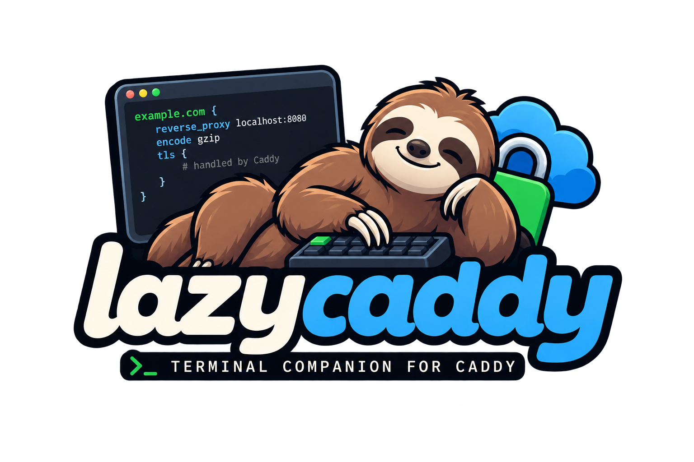

# lazycaddy

<p align="center">
  
</p>

> The lazier way to manage your Caddyfile.

lazycaddy is a keyboard-first terminal user interface for inspecting and managing Caddy while preserving the Caddyfile as the source of truth.

The project is under active development. Read the project direction and implementation constraints first:

- [VISION.md](VISION.md) — product vision and design principles;
- [PLAN.md](PLAN.md) — scope, architecture, safety workflow and roadmap;
- [AGENTS.md](AGENTS.md) — repository and contributor guidelines.

## Development

Requirements:

- Go 1.26 or newer;
- Caddy is not required for unit tests;
- network access is not required by tests.

Run the current TUI:

~~~sh
go run ./cmd/lazycaddy
~~~

Run checks:

~~~sh
make check
~~~

Show build information:

~~~sh
go run ./cmd/lazycaddy --version
~~~

The release process is documented in [docs/releasing.md](docs/releasing.md).

## Current status

The lossless Caddyfile parser and patcher are complete. The current vertical
slice is a read-only-by-default inspector with an opt-in format, validate,
diff, edit, save and reload workflow:

- load a Caddyfile and resolve nested imports while keeping imported files as
  separate documents;
- browse sites, directives, parse errors and raw source without discarding
  comments, whitespace or unknown directives;
- run `caddy fmt` and `caddy validate` (`v`) against a temporary working copy,
  with structured diagnostics and a detailed view;
- review a colored unified diff (`D`) before applying formatting changes;
- save only after successful validation (`s` in writable mode), creating a
  timestamped backup and replacing the source through a same-directory atomic
  write;
- reload through the local Admin API (`r`) only after a validated, saved
  configuration and a confirmation that names the target, with saved,
  validated and loaded states shown in the header;
- detect external changes before saving and report a recovery backup if a
  write fails after backup creation.

The inspector also provides:

- Caddy version, Admin API reachability and capability status in the header;
- an opt-in, rotation-aware log view with bounded history and JSON
  highlighting (`--log-file`, `l`);
- `$EDITOR` editing for a selected node (`e`) or an entire document (`E`),
  including imported files, with validation, diff review and the same backup
  and atomic-save pipeline;
- read-only global search across nodes, files, source lines and loaded logs
  (`/` or `Ctrl-F`);
- exact-range node deletion (`d`) with diff confirmation and post-save tree
  rebuilding.

The application is read-only by default and never reloads Caddy implicitly.
Unavailable capabilities disable only the affected actions, while browsing
and raw source inspection remain available.

### Safe change workflow

```text
load -> edit working copy -> format and validate -> review diff
  -> confirm -> create backup -> atomic save -> optional confirmed reload
```

To enable formatting and validation, provide the Caddy binary explicitly:

~~~sh
go run ./cmd/lazycaddy --config ./Caddyfile --caddy-path /usr/bin/caddy
~~~

To enable saving, add `--write`. The default backup directory is
`<config-dir>/.lazycaddy/backups`; it can be overridden with `--backup-dir`.
Formatting, validation and saving use temporary or atomic file operations and
do not require a running Caddy daemon. Reloading does require Caddy to be
running with its Admin API enabled and reachable at the configured endpoint.

Reloads use the local Admin API at `http://localhost:2019` by default;
override the endpoint with `--admin-endpoint` and the per-request timeout
with `--admin-timeout`. A reload never happens implicitly.

## License

See [LICENSE](LICENSE).
